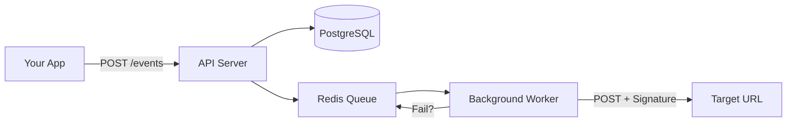

# WebhookDrop 📦🚀

WebhookDrop is a **reliable, high-performance webhook delivery engine** designed to act as a "Reliable Postman" between your application and its third-party consumers. It ensures that every event is delivered, even if the receiver is temporarily offline, using a robust retry system with exponential backoff.

## 🌟 Key Features
- **Reliable Delivery:** Powered by BullMQ and Redis for background job persistence.
- **Smart Retries:** Exponential backoff with **Jitter** to prevent "thundering herd" issues.
- **HMAC Security:** Every payload is signed with a secret key, so receivers can verify it's really from you.
- **Chaos Simulator:** Built-in tool to test how your architecture handles flaky connections.
- **Modern Dashboard:** A polished React + Tailwind CSS UI to monitor all deliveries in real-time.

## 🏗️ Architecture


## 🚀 Quick Start (Local)

### 1. Start Infrastructure
```bash
docker-compose up -d
```

### 2. Start API (Backend)
```bash
cd apps/api
npm install
npm run dev
```

### 3. Start Dashboard (Frontend)
```bash
cd apps/ui
npm install
npm run dev
```

## 📖 API Reference

### Register Endpoint
`POST /endpoints`
```json
{
  "url": "https://yourapp.com/hook",
  "secret": "your-signing-secret",
  "label": "Production"
}
```

### Fire Event
`POST /events`
```json
{
  "payload": {
    "type": "order.completed",
    "id": "123"
  }
}
```

---
Built with ❤️ for reliable software.
